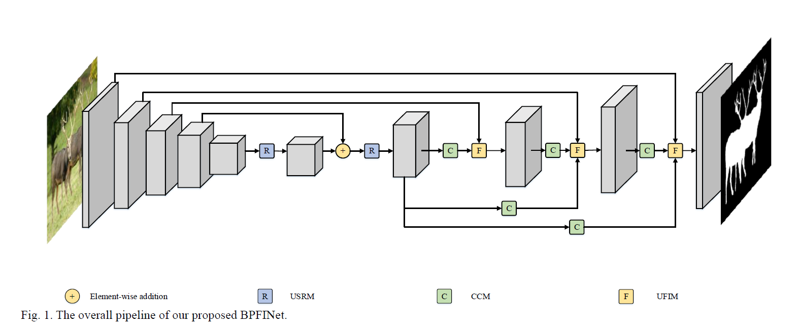
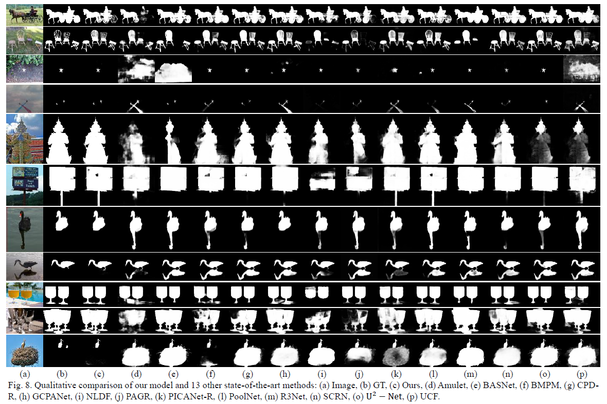
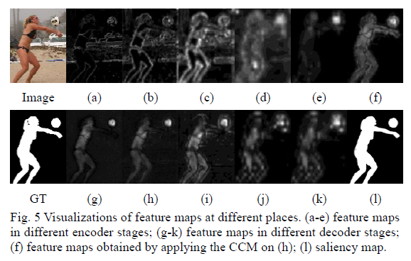

# BPFINet
# [BPFINet: Boundary-aware Progressive Feature Integration Network for Salient Object Detection](https://doi.org/10.1016/j.neucom.2021.04.078)

This repo. is an official implementation of the *BPFINet* , which has been accepted in the journal *Neurocomputing, 2021*. 

The main pipeline is shown as the following, 


And some visualization results are listed 




## Dependencies 
```
>= Pytorch 1.0.0
OpenCV-Python
[optional] matlab
```

## Training
pretrained resnet50 is available at ([Baidu](https://pan.baidu.com/s/1K4-b6JPi6E34kgH8gdbYqQ)) [code:nfih]
```
python deep_supervision_main.py 
```

## Test
```
 python deep_supervision_main.py --mode=test 
```
We provide the trained model file ([Baidu](https://pan.baidu.com/s/15n6U0YfPJJBdH5FuPmUeaQ)) [code:c4pm]

The saliency maps are also available ([Baidu](https://pan.baidu.com/s/12KoIhp28v8sk1KBwFlXC0g)). [code:sbre]

## Citation
Please cite the `BPFINet` in your publications if it helps your research:
```
@article{CHEN2021,
  title = {BPFINet: Boundary-aware Progressive Feature Integration Network for Salient Object Detection},
  author = {Tianyou Chen and Xiaoguang Hu and Jin Xiao and Guofeng Zhang},
  journal = {Neurocomputing},
  year = {2021},
}
```
## Reference
[poolnet](https://github.com/backseason/PoolNet)
